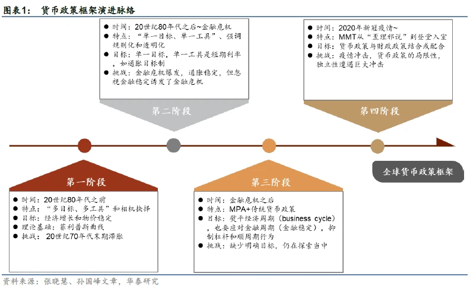
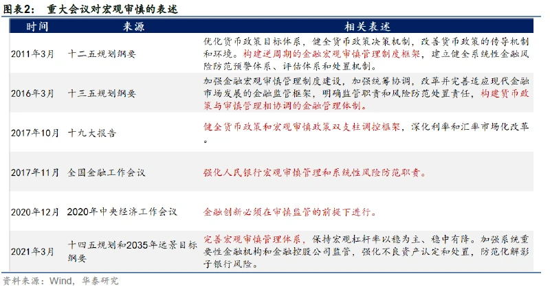
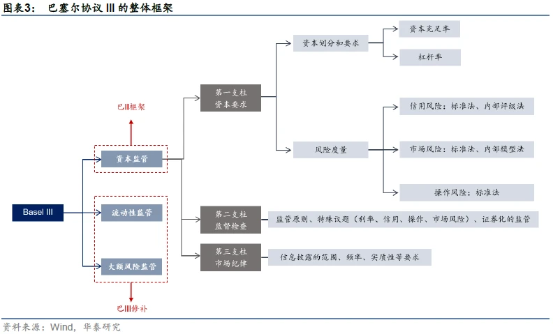
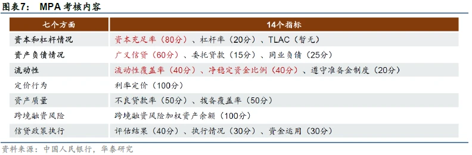
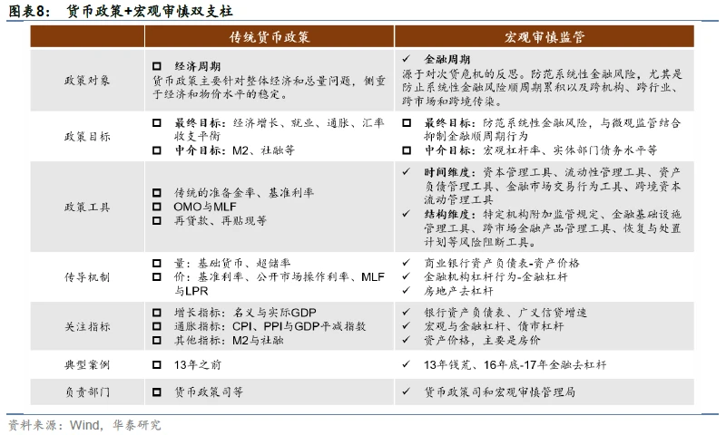
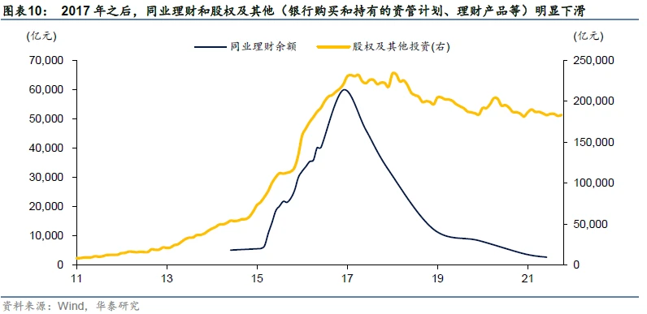
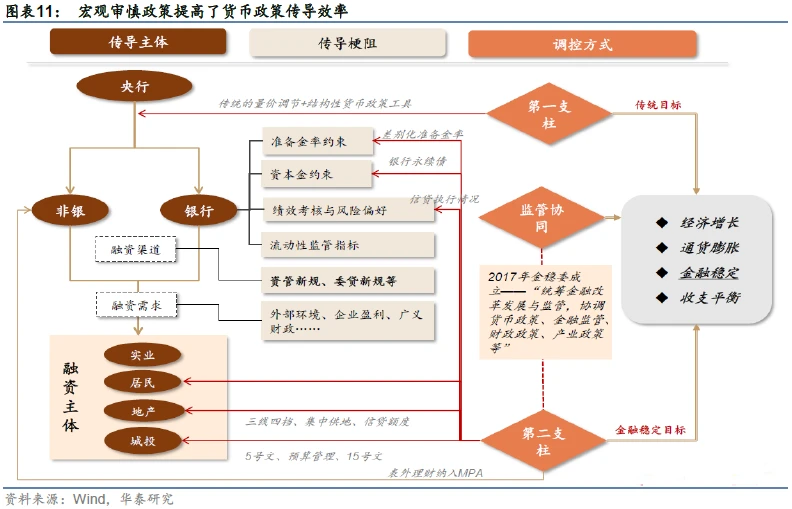

???+note

	本页面介绍中国目前的监管体系，为2018年3月13日国务院机构改革之后的体系，后续根据调整更新。

## 一、一委一行两会

根据国务院3月13日发布的机构改革方案，银监会和保监会合并，组建中国银行保险监督管理委员会，作为国务院直属事业单位，统一监管银行业和保险业。

截至2022年，我国目前金融监管体制（一行三会 → 一行一委两会），合并原来的分业监管体系，适应混业经营。

### 1、金稳委

金融委(国务院金融稳定发展研究委)，加强宏观审慎保障金融稳定，并协调监管。

无论是在机构定位还是在职责定位上，金稳委都发挥着统筹协调金融改革发展与监管的金融业“大总管”作用。2017年11月8日，经党中央、国务院批准，金稳委正式成立，作为国务院统筹协调金融稳定和改革发展重大问题的议事协调机构。

在2017年10月召开的世界银行年会上，央行行长周小川提出金稳委未来将重点关注的四方面问题，包括影子银行、互联网金融、资产管理行业和金融控股公司

### 2、央行

在此次银监会、保监会合并的过程中，央行在机构设置上没有变化，但值得关注的是，银监会、保监会重要法律法规草案和审慎监管基本制度的拟订权将划归央行。

央行统筹监管双支柱框架“货币政策和宏观审慎政策”。

**我国货币政策与宏观审慎两大支柱是如何分工的？**

第一，货币政策调控对象是经济周期，宏观审慎调控金融周期。

第二，货币政策主要盯住增长和通胀等目标，宏观审慎主要盯住广义信贷和资产价格等。

第三，货币政策与宏观审慎工具不同。

第四，货币政策与宏观审慎的传导机制不同。

第五、宏观审慎的内涵在不断丰富，有明显的问题导向特征。

不过，双支柱框架也不是万能的，货币政策多目标压力依然存在，且传统的量价工具也需要考虑到对金融系统的外溢影响，长期看，二者的协调大于分工。

#### 2.1 货币政策

货币政策，是指中央银行为实现其特定的经济目标，运用各种工具来调节货币供应量，进而来调节市场利率，通过市场利率的变化来影响民间的资本投资，从而影响总需求来影响宏观经济运行的各种方针措施。

**1、常规工具**

被称为中央银行的 “三大法宝”。主要是从总量上对货币供应量和信贷规模进行调节。

① 存款准备金。

存款准备金，是限制金融机构信贷扩张和保证客户提取存款和资金清算需要而准备的资金。法定存款准备金率，是金融机构按规定向中央银行缴纳的存款准备金占其存款的总额的比率。

② 公开市场业务。

公开市场，是指各种有价证券自由成交，自由议价，其交易量和价格都必须公开显示的市场。公开市场业务，是指中央银行利用在公开市场上买卖有价证券的办法来调节信用规模、贷币供应量和利率以实现其金融控制和调节的活动，是货币政策的最重要的工具。

③ 再贴现。

贴现，是票据持票人在票据到期之前，为获取现款而向银行贴付一定利息的票据转让。再贴现，是商业银行或其他金融机构将贴现所获得的未到期票据，向中央银行作的票据转让。  贴现是商业银行向企业提供资金的一种方式，再贴现是中央银行向商业银行提供资金的一种方式，两者都是以转让有效票据——银行承兑汇票为前提的。

**2、选择工具**

是指中央银行针对某些特殊的信贷或某些特殊的经济领域而采用的工具，以某些个别商业银行的资产运用与负债经营活动或整个商业银行资产运用也负债经营活动为对象，侧重于对银行业务活动质的方面进行控制，是常规性货币政策工具的必要补充，常见的选择性货币政策工具主要包括：

① 消费者信用控制；

② 证券市场信用控制；

③ 不动产信用控制；

④ 优惠利率；

⑤ 特种存款

**3、补充工具**

其它政策工具，除以上常规性、选择性货币政策工具外，中央银行有时还运用一些补充性货币政策工具，对信用进行直接控制和间接控制。包括：

① 信用直接控制工具，指中央银行依法对商业银行创造信用的业务进行直接干预而采取的各种措施，主要有信用分配、直接干预、流动性比率、利率限制、特种贷款；

② 信用间接控制工具，指中央银行凭借其在金融体制中的特殊地位，通过与金融机构之间的磋商、宣传等，指导其信用活动，以控制信用，其方式主要有窗口指导、道义劝告。

**4、新工具**

2013年11月6日，我国央行网站新增“常备借贷便利(SLF)”栏目，标志着这一新的货币政策工具的正式使用。

央行于2013年初创设这一工具。常备借贷便利(简称SLF)，在各国名称各异，如美联储的贴现窗口、欧央行的边际贷款便利、英格兰银行的操作性常备便利、日本银行的补充贷款便利、加拿大央行的常备流动性便利等。

所谓常备借贷便利就是商业银行或金融机构根据自身的流动性需求，通过资产抵押的方式向中央银行申请授信额度的一种更加直接的融资方式。由于常备借贷便利提供的是中央银行与商业银行“一对一”的模式，因此，这种货币操作方式更像是定制化融资和结构化融资。

常备借贷便利的主要特点：

① 是由金融机构主动发起，金融机构可根据自身流动性需求申请常备借贷便利；

② 二是常备借贷便利是中央银行与金融机构“一对一”交易，针对性强。

③ 三是常备借贷便利的交易对手覆盖面广，通常覆盖金融机构。

**5、货币政策工具运用**

中国人民银行可以运用的货币政策工具有6种，其作用与意义如下：

① 公开业务

运用国债、政策性金融债券等作为交易品种，主要包括回购交易、现券交易和发行中央银行票据，调剂金融机构的信贷资金需求。

② 存款准备金

通过调整存款准备金率，影响金融机构的信贷资金供应能力，从而间接调控货币供应量。

③ 银行贷款

运用再贷款政策、再贴现政策调剂金融机构的信贷资金需求，影响金融机构的信贷资金供应能力。

④ 利率政策

根据货币政策实施的需要，适时的运用利率工具，对利率水平和利率结构进行调整，进而影响社会资金供求状况，实现货币政策的既定目标。

⑤ 汇率政策

通过汇率变动影响国际贸易，平衡国际收支。

#### 2.2 宏观审慎政策

宏观审慎起源于2008年金融危机，其概念与微观审慎相对应，核心特征是建立更强的、体现逆周期性的政策体系。从海外经验来看，大部分国家都是央行主导宏观审慎管理。我国实行的是货币政策-宏观审慎双支柱框架，前者调控经济周期，后者调控金融周期。2021年底，央行发布了《宏观审慎政策指引（试行）》，标志着我国双支柱框架从制度上又迈出一大步。如何看待双支柱框架的影响？首先，宏观审慎降低了传统货币政策“多目标压力”。其次，两大支柱协调配合，增强了货币政策传导效率。最后，双支柱框架有助于稳定宏观环境，降低市场波动，但也难免带来“逆向选择”。

**(1)、宏观审慎的起源与海外经验**

大滞胀之后到2008年之前，货币政策放松没有催生通胀，但通过资产泡沫也可能加剧金融体系的不稳定性，最终导致金融危机爆发。由此开始，各国着手探索宏观审慎框架。宏观审慎与微观审慎相对应，核心特征是建立更强的、体现逆周期性的政策体系。海外的宏观审慎管理是怎么做的？首先在指标约束上，巴塞尔协议III已经为全球提供了范本，主流经济体包括我国在内，都基本沿用了这一思路。其次在监管架构方面，美国FSOC有名无实，美联储掌握宏观审慎管理实权，英国则可以大致概括为“三大机构、一套人马”。欧元区：以欧央行为核心，各国当局共同负责。

**首先需要明确的概念是，我们常提的“宏观审慎”到底是什么？** 宏观审慎是与微观审慎相对应的。2000年，时任BIS总经理的Crockett首次界定了宏观审慎的概念——“微观审慎是以保障单个金融机构稳健为目标，而宏观审慎是以维护整个金融体系为目标”。

举例而言，巴塞尔协议I对银行资本充足率的要求为8%，微观审慎之下，只要各家银行满足这一标准，就可以认为金融体系是健康的。然而，资本充足率这一指标本身有很强的顺周期性：经济上行阶段资产价格上涨企业抵押物价值提高资产风险值较低分母相对下降，此时如果维持8%的资本充足率，分子端的资本要求其实是被低估的，从而使得银行信贷扩张能力进一步加强，加剧宏观经济过热。相反在经济下行阶段，资产质量迅速下降，分母相对高估，此时如果维持8%的资本充足率要求，银行资本补充压力就会加大，放贷能力受到影响。**因此可以看出，静态的资本充足率起到了对整个信贷周期和经济周期推波助澜的作用**。

**上述过程主要体现了微观审慎监管在风险指标的顺周期性上存在局限，而除此之外，微观审慎还在其他方面存在缺陷：** 例如因跨行业、跨市场传染所产生的系统性风险（例如表外金融创新引起的层层嵌套），以及系统重要性金融机构的外部性（雷曼倒闭对经济体的影响显然比一般金融机构更大）。

**宏观审慎则有效弥补了微观审慎监管的缺口，核心特征是建立更强的、体现逆周期性的政策体系。例如，资本充足率指标不应是静态的，而要根据经济周期动态变化，以及对商业银行流动性要求、杠杆率要求、会计标准，衍生产品交易的规范等**。

**(2)、海外的宏观审慎管理是怎么做的？**

首先在指标约束上，巴塞尔协议III已经为全球提供了范本，主流经济体包括我国在内，都基本沿用了这一思路，从巴III三大关键变化来看：

一是除了最低资本要求以外，增加了宏观审慎资本要求。首先是2.5%的普通股资本留存缓冲，这部分是固定的。其次是逆周期资本缓冲，这部分是浮动的，各国可根据“信用（贷）/GDP”超出其趋势值的程度等，要求银行增加0%-2.5%的逆周期资本缓冲。也就是信贷增速>经济增速时，资本充足率需要提高。

二是系统重要性银行要高于及格线，有一定附加资本要求。

三是加强对流动性和杠杆率的要求。提出了流动性覆盖比率（LCR）和净稳定融资比率（NSFR）两个指标。前者用来衡量银行短期流动性水平，后者主要衡量长期流动性水平，核心都是限制期限错配。

**(3)、我国货币政策与宏观审慎两大支柱是如何分工的？**

我国货币政策长期以来都实行多目标制（增长、通胀、金融稳定和国际收支平衡），双支柱框架的本质就是将金融稳定目标尽量“剥离”给宏观审慎，而传统政策更多关注增长和通胀。

第一，货币政策调控对象是经济周期，宏观审慎调控金融周期。

第二，货币政策主要盯住增长和通胀等目标，宏观审慎主要盯住广义信贷和资产价格等。

第三，货币政策与宏观审慎工具不同。

第四，货币政策与宏观审慎的传导机制不同。

第五、宏观审慎的内涵在不断丰富，有明显的问题导向特征。

不过，双支柱框架也不是万能的，货币政策多目标压力依然存在，且传统的量价工具也需要考虑到对金融系统的外溢影响，长期看，二者的协调大于分工。

**(4)、如何理解央行的《宏观审慎政策指引（试行）》**

2021年12月31日，央行发布了《宏观审慎政策指引（试行）》，标志着我国双支柱框架从制度上又迈出一大步。

本次《指引》核心内容可以归结为四大要素，两个维度。

- 要素一，宏观审慎政策的目标是防范系统性金融风险。
- 要素二，系统性金融风险的监测、识别和评估。
- 要素三，宏观审慎政策工具具有“宏观、逆周期、防传染”的基本属性和“时变”特征。
- 要素四，宏观审慎与货币政策、微观审慎及其他政策的协调。

两大维度主要指时间和结构，在《指引》中被多次提及。一方面是系统性金融风险来源于时间和结构两个维度。另一方面工具也可分为时间和结构两大维度。

首先时间维度上，央行提出五大工具：

- （1）资本管理工具，通过调整对金融机构资本水平施加的额外监管要求、特定部门资产风险权重等，抑制由资产过度扩张或收缩、资产结构过于集中等导致的顺周期金融风险累积。
- （2）流动性管理工具，主要是约束银行的期限错配程度。
- （3）资产负债管理工具，最典型的指标是广义信贷。
- （4）金融市场交易行为工具，主要通过调整对金融机构和金融产品交易活动中的保证金比率、融资杠杆水平等施加的额外监管要求。例如在期货交易热度过高时提高保证金比例。
- （5）跨境资本流动管理工具，近两年央行多次调整外汇风险准备金和外汇存款准备金，防范跨境资本“大进大出”。

其次结构维度上，有四大工具：

- （1）特定机构附加监管规定，这一项主要是针对系统重要性银行，前期央行发布了《系统重要性银行附加监管规定（试行）》，提出了附加资本等要求。
- （2）金融基础设施管理工具，主要是针对结算托管等基础设施稳健性。
- （3）跨市场金融产品管理工具，主要通过加强对跨市场金 融产品的监督和管理，防范系统性金融风险跨机构、跨市场、 跨部门和跨境传染。
- （4）恢复与处置计划等风险阻断工具。

**(5)、双支柱框架有何影响？**

首先，宏观审慎降低了传统货币政策“多目标压力”。

其次，双支柱调控下，两大支柱协调配合，增强了货币政策传导效率。几大工具定位更加清晰。

最后，双支柱框架有助于稳定宏观环境，降低市场波动，但也难免带来“逆向选择”。具体而言，对于宏观经济而言，两大支柱相互配合可以为经济增长创造更加稳定的宏观环境。对于市场而言，货币政策大开大合的情况越来越少，市场波动明显减弱。但广义信贷指标等考核反而会加大季末的资金面波动。

2013年和2017年的两轮收紧就是典型案例:

**(6)、两大支柱协调配合，增强了货币政策传导效率**

传统货币政策通过流动性的纵向传导调控经济，但这一过程面临诸多梗阻，我们总结至少有三大环节：

第一，资本约束：主要是资本充足率约束银行资产端的扩张，尤其是经济下行周期中资产质量变差，分母端增大，银行需要补充更多资本，进一步制约信贷扩张能力。

第二，监管指标：流动性考核等导致银行争夺一般存款，变相提高了银行负债成本，从而导致政策利率-市场利率-信贷利率难以有效传导。

第三，风险偏好：银行信贷资源的分配是不均衡的，房地产天然有抵押物优势，城投有地方政府信用背书，两大主体更容易从银行获得贷款，这就导致每一轮“放水”，收益的都是地产城投，中小企业融资困境难以改善。

### 3、银保监会

对于银监会与保监会的合并，业内普遍认为这能够在统一监管标准、减少沟通成本、杜绝监管套利等方面发挥积极作用。通过加强微观审慎以保障个体金融机构稳定，保障消费者权益保护。

银保合并后，实际还是会分部门来监管，保险依然是一个大部门，但协调性会更高。如此前一些保险公司入股银行，其保险产品也迅速入驻银行，这种逻辑未来可能会更加明显，因此把银保监管系统合并，可能在监管交叉业务方面会更有效率

### 4、证监会

监管证券市场，保持证券市场的稳定健康发展.

## 二、银行业监管指标

### 1、资本指标

#### 1.1 资本充足率

> 资本充足率=(总资本-对应资本扣减项)/风险加权资产 × 100% 

> 一级资本充足率=(一级资本-对应资本扣减项)/风险加权资产 × 100% 

>核心一级资本充足率=(核心一级资本-对应资本扣减项)/风险加权资产 × 100% 

**其中资本组成如下：**

> 核心一级资本：实收资本或普通股；资本公积；盈余公积；一般风险准备；未分配利润；少数股东资本可计入部分；

> 其他一级资本：其他一级资本工具及其溢价；少数股东资本可计入部分；

> 二级资本：一级资本工具及其溢价；超额贷款损失准备；少数股东资本可计入部分；

**商业银行资本充足率要求**

> 核心一级资本充足率 ≥ 5%

> 一级资本充足率 ≥ 6%

> 资本充足率 ≥ 8%

#### 1.2 杠杆率

> 杠杆率=（一级资本-一级资本扣除项）/调整后的表内外资产余额 × 100%

**商业银行杠杆率要求**

> 并表和未并表的杠杆率 ≥ 4%

### 2、信用风险指标

#### 2.1 大额风险暴露

> 非同业单一客户贷款余额 ≤ 资本净额 ×  10%

> 非同业单一客户风险暴露  ≤ 一级资本净额 ×  10%

> 非同业关联客户贷款余额 ≤ 资本净额 ×  15%

> 非同业关联客户风险暴露  ≤ 一级资本净额  ×  20%

> 同业单一客户或集团风险暴露  ≤ 一级资本净额 ×  25%

> 另一家全球重要性银行风险暴露  ≤ 全球重要性银行的一级资本净额 ×  15%

> 单一合格中央交易对手的非清算风险暴露  ≤ 商业银行的一级资本净额 ×  25%

> 单一不合格中央交易对手的清算/非清算风险暴露  ≤ 商业银行的一级资本净额 ×  25%

#### 2.2 全部关联度

> 关联方的授信余额 ≤ 银行资本净额  ×  10%

> 关联法人或其他组织所在集团客户的授信余额总数 ≤ 银行资本净额  ×  15%

> 全部关联方的授信余额总数 ≤ 银行资本净额  ×  50%

#### 2.3 不良贷款率和不良资产率

> 不良贷款率 = 不良贷款余额/各项贷款余额 ≤ 5%

> 不良资产率= 不良资产余额/资产总额  ≤ 4%

#### 2.4 拨备覆盖率和贷款拨备率

> 贷款覆盖率 = 贷款损失准备/各项贷款余额 in 1.5%~2.5%

> 拨备覆盖率 = 贷款损失准备/不良贷款余额 in 120%~150%

### 3、流动性风险指标

#### 3.1 流动性比率

> 流动性比率 = 流动性资产余额/流动性负债余额 × 100% ≤ 25%

#### 3.2 流动性覆盖率

> 流动性覆盖率 = 合格优质流动性资产/未来30天现金净流出量 × 100% ≤ 100%

#### 3.3 净稳定资金比例

> 净稳定资金比例 = 可用的稳定资金/所需的稳定资金 × 100% ≤ 100%

> 可用的稳定资金 = 各类资本与负债项目的账目价值×对应的可用资金系数

> 所需的稳定资金 =（各类资本与负债项目的账目价值 + 表外风险敞口）×对应的可用资金系数

#### 3.4 流动性匹配率

> 流动性匹配率 = 加权资金来源/加权资金运用 × 100% ≤ 100%

> 加权资金来源：中央银行的资金、各项存款、同业存款、同业拆入、卖出回购、发行债券及发行同业存单等项目。

#### 3.5 优质流动性资本充足率

> 优质流动性匹配率 = 优质流动性资产/短期现金净流出 × 100% ≤ 100%

> 优质流动性资产：指能够通过出售或者抵质押方式，在无损失或极小损失的情况下在金融市场快速变现的各类资产。

### 4、市场风险指标

> 商业银行累计外汇头寸比率 ≤ 资本净额 × 20%

## 三、法律法规

### 1、央行法规

1. 宏观审慎政策指引（试行）http://www.gov.cn/xinwen/2022-01/01/5665976/files/d7e55e8a7dce4b179d71fcf70aa49bed.pdf

### 2、银行业监管法规

1. 《中华人民共和国银行业监督管理法》: http://www.gov.cn/jrzg/2006-10/31/content_429279.htm
2. 《中华人民共和国反洗钱法》: http://www.gov.cn/jrzg/2006-10/31/content_429245.htm
3. 《中华人民共和国民法典》: http://www.npc.gov.cn/npc/c30834/202006/75ba6483b8344591abd07917e1d25cc8.shtml