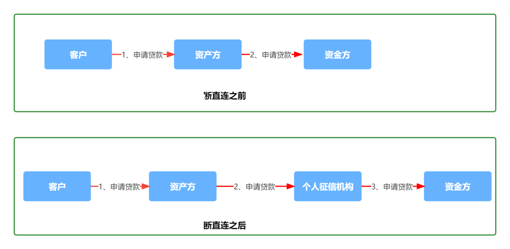
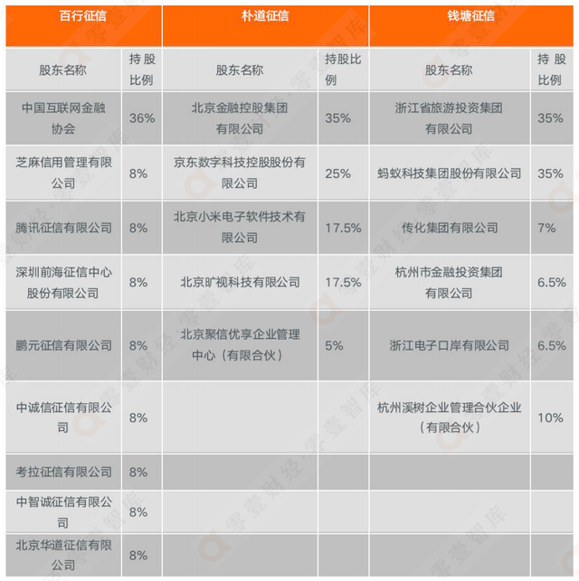

目前几大头部互联网流量机构接到监管通知，要在2022年11月底完成信贷领域的断直连试点工作。

网上看了几篇文章发现都语焉不详，啰里啰唆，只能自己梳理这一事件的来龙去脉，以究其背景和方案是如何。

**1、何为断直连？**

过去互联网平台的和资金方（银行、消费金融公司等）合作放款的模式以助贷模式为主，其本质是由银行查央行征信，互联网平台提供风控和流量。

断直直连之后，监管要求客户信息必须由资产方传给个人征信机构，由个人征信机构传给资金方。

**即资产方（互联网流量平台）不能绕过个人征信机构和资金方进行放款交易。**

**2、其信息流程如图：**  

**3、其依据来自：**

央行征信局的《征信业务管理办法》。

明确了：自2022年1月1日起施行。信用信息的采集、整理、保存、加工等全流程合规管理“断直连”，明确了征信业务边界，加强了信息主体权益保护。

《征信业务管理办法》考虑了互联网平台、数据公司等机构与金融机构业务合作模式的调整，对本办法施行前未取得征信业务资质但实质从事征信业务的市场机构给予了一定的业务整改过渡期，过渡期为本办法施行之日至2023年6月底。

**4、其监管背景:**  

最近在各种国家会议提出，数据是一种生产要素，那么金融业务，涉及国计民生等重大问题，不得不察，其数据的方方面面需要掌握。

断直连之前，资产平台和资金平台对接，资金平台调用央行征信，央行征信机构是不掌握资产平台（互联网流量平台）数据的。

这不符合征信管理在生产要素的管理颗粒度。

当然还有风控层面和个人信息保护层面的后续好处，这点后面会讲。

**5、目前涉及的持牌个人征信公司有**  

百行征信

朴道征信

钱塘征信  

其特点都是国有控股，加上具有金融、生活、电商等数据属性的数据公司和金融科技私企公司参股。

不同的私企属性，使得其数据产品有不同的特点，当然这个和断直连这件事没有直接关系，但未来各家资金方可以根据自己的产品特性，接入不同的个人征信机构。

央行征信则主要记录个人或者企业的信用信息，包括借贷、担保、纳税信用等等方面，数据主要来自于传统的金融机构，比如说银行、持牌消费金融之类。

个人征信公司除了个人的金融数据之外，包括生活数据、电商数据等数据。

将个人的消费金融贷款、生活数据进行了收集，很大程度上是对央行征信的完善和补充，两者结合结合起来。

**个人信息对央行就是“透明化”的，此监管天眼打开。**

**6、其带来的意义有：**  

-   **征信监管：** 
    

未来涉及个人信息共享的，流程需要按照个人征信的基本要求去开展和执行，各方需要积极对接持牌征信机构，如上所述，监管天眼打开。

-   **个人信息保护：**
    

对于部分信息，假如个人征信公司不收集不接受，而互联网平台不能和金融机构直连，那么互联网平台收集信息也没有**直接动力，当然间接动力还是存在的，有野心的大平台都喜欢自己存点私房数据。**  

-   **策略输出：**
    

过去互联网平台的风控策略结果都不愿意和资金方共享，有啥风险字段都藏着掖着，现在个人征信公司，集齐了所有平台的数据，其策略优化有了数据基础。

**7、断直连之后的信息流程：**

按照“平台-个人征信机构-金融机构流程，和监管思想，可以分成三种。

**（1）接口层面断直连  
**

-   图例标记只要是授信申请，实际业务中当然用信申请也包括。  
    
-   其流程是授信申请or用信申请 资产方（互联网平台）传给个人征信机构，这里要明确是整个接口直接由个人征信机构提供。  
    
-   资产方所有的申请入参都传给个人征信机构，这样个人征信机构本地保存一份申请记录。
    
-   并且调用资金方的申请接口，把资产方的数据传给资金方。  
    
-   授信or用信通知，由资金方通知个人征信机构，个人征信机构通知资产方。
    
      
    
-   **此方案的特点：**
    

资金方接入or切换成本低，只需要把和资产方的接口，切换成资金方的接口即可，接口层面切换，逻辑也比较清晰。  

同时断直连也断的也彻底，整个接口，不管是监管字段还是非监管字段，都全部上交国家。

**（2）信息层面断直连**  

-   图例标记只要是授信申请，实际业务中当然用信申请也包括。  
    
-   其流程是授信申请or用信申请 资产方（互联网平台）把客户基本信息、设备信息、风险字段等传给个人征信机构，个人征信机构返回一个授权码。
    
-   资产方拿着这个授权码，授信申请or用信申请传给资金方，资金方收到申请之后。  
    
-   再用授权码去个人征信机构查询相关客户信息。
    
-   资金方申请结果通知给资产方。
    
      
    
-   **此方案特点：**
    

此方案断了一半，交互也稍复杂，个人征信机构沦为纯粹的数据收集方，并不知道交易是否成功和失败。

孰是孰非，时间自有定论。  

**（3）流量层面断直连**  

-   根据监管要求，既然不让资产方和资金方直接信息交互，那么资产方也可以选择躺平，客户从录入信息的界面，就让资金方提供，比如挂一个h5。
    
-   客户填完信息直接发送到资金方，资金方审核通过后直接在h5上展示给客户。
    
-   资产方在这里只提供一个入口，自己收一点流量费用，其它都省心了。
    
      
    

**此方案特点：**

此方案目前适合比较小的流量平台，不需要投入什么开发人力。

但是可以作为一个模板，其实未来，监管的期望就是大的流量平台收流量费用，数据和风险等都让个人征信机构和资金方来做。

**8、断直连对行业的影响：**

短期来看：

对互联网平台的成本有影响，目前所有的业务都需要切换到个人征信机构，需要有一次性研发投入。

其次是新增了数据成本，因为要借用征信机构的接口给金融机构传送数据，比如有数据成本，行业内一般按照接口调用次数收费。

长期来看：

相当于从数据层面被监管拿捏的死死的，后续监管的号令将会更加有效。

监管的长期诉求是流量平台只收流量费用，个人征信公司拿数据，金融机构做风险和业务。

随着断直连的正式落地，此抓手也逐步形成！

总之跟着政策走，在这个行业才能长远生存。