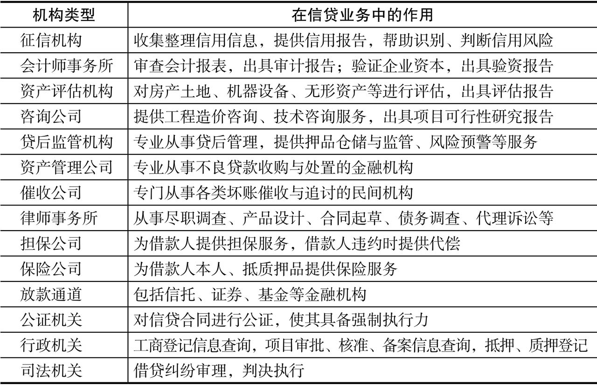

???+note

    本页面将着重介绍信贷的基础知识，包括什么是信贷、信贷的基础概念、信贷的业务流程、风险管理等内容。

## 一、什么是信贷

金融的本质是跨时空的价值交换，是信用、杠杆和风险的总和，是钱生钱的游戏。信贷是金融重要组成部分，是以货币为起点和终点的借贷行为，是企业借债还钱的活动。

按银行从业资格考试教材《公司信贷》中的广义定义：“信贷是一切以实现承诺为条件的价值运动形式，包括存款、贷款、担保、承诺、赊欠。”要深入理解该定义，就要了解信用风险。信用与信贷，这两个词的英文都是credit。

信贷中的借债还钱，总是跟信用、杠杆和风险联系在一起，低信用加上高杠杆就一定会发生风险。本章主要简要介绍下信贷产品，为之后的进阶内容做铺垫。

## 二、信贷的基础概念

贷款、借款、信贷、授信、融资，这些词汇经常被混用。贷款是最传统、最广泛的银行信贷业务，银行提供资金、到期收回本息，银行是贷款方，客户是借款人。

### 2.1 信贷的借款方

借款方，即贷款机构借款的客户，根据客群群体的不同，一般可以分为个人类和企业类客户，根据客户的贷款用途、行业可以进一步细分，如下：

### 2.2 信贷的贷款方

贷款方，又称为贷款机构，目前的贷款方包括三大类：

- 一是受银监会监管的传统金融机构，包括银行和非银行金融机构；
- 二是不受银监会监管的放贷机构，如小额贷款公司、民间借贷等；
- 三是一般性的商业信用。后两类一般称为“影子银行”。

### 2.3 其他相关机构

这些机构，可以分为两类：一类是政府部门；另一类是市场化机构。

### 2.4 额度和定价

对于有信贷需求的人来说最关注的就是额度和定价（利率）。

额度基本是基于申请人的收入水平来计算，而定价则和用户质量以及机构风控水平息息相关。

利率定价相关的内容详见[利率](利率.md)。

### 2.5 还款方式

在常见的信贷产品介绍中（某呗、信用卡分期、房贷、平台借贷、消费分期、消费贷等）都有关于还款方式和利率的说明，不同还款方式适用的产品，以及客户的真实利率（IRR) 都会有所区别。

还款方式的详细内容见[还款方式](还款方式.md)。

## 三、信贷的业务和风险管理

### 3.1 信贷业务风险

银行一方面从存款人那里借入资金，另一方面把资金贷放给借款人，赚取利差，这就是银行运行的基本逻辑。

*这种业务模式有两大风险：*

- 一是借款人是否会如期还款，即信贷风险；
- 另一个是存款和贷款的期限匹配问题，即流动性风险，如何管理流动性风险

**银行的流动性风险**

我们经常说企业资金链风险、现金流管理，其实银行面临的流动性风险要远远大于一般工商企业，银行的资产负债率基本在90%以上，这就要求银行要有极高的风险管理水平。

**如何管理流动性风险？**

一是拉存款，资金进进出出，只要进来得多、出去得少就可以维持，当然如果只用这一招就是庞氏骗局；

二是日常管理中不把所有资金都投放出去，要保持一定的存款准备金，当然这样会降低利润；

三是增加资本金，《巴塞尔协议》作为银行业风险管理的通用文件，其中最重要的要求就是银行必须维持一定资本金比例，即资本充足率要求。通过资本充足率约束，实际上是把银行的经营风险从存款人身上转移到股权投资人身上。

**信贷风险管理**

应付了短期流动性危机以后，贷款是否能收得回来就是关键，最终还是落脚到信贷业务风险管理。

信贷风险管理是指通过风险识别、计量、监测和控制等程序，对风险进行评级、分类、报告和管理的过程。

银行对信贷风险管理的认识也是渐进的：

早期的风险管理工作就是信贷审查审批，做好每一笔贷款风险控制，确保每笔业务不出事，出了不良就尽量去催收。这种信贷管理主要是基于信贷专家的经验法则和主观判断，其不足之处是风险集中。审贷官一方面积累了经验，但是他们也积累了“偏见”，在选择客户时必然有偏好，长期下来，就会形成客户的风险同质化，一旦银行判断失误，就会造成一片客户的坏掉。

于是就有了集中度管理，这是最基础的风险管理，例如对客户、行业、区域设定最高风险限额，对审贷官设定最高审批权限等。不要过分关注单笔业务本身的风险，而是要关注其对整个信贷资产组合的风险边际贡献度，有时候银行需要主动去承担一些风险贷款，利用业务之间的负相关关系来“中和”存量业务的风险。

上面这些风险管理方法都是停留在信贷管理阶段，实际上真正的风险管理应该是和信贷发放相分离，利用金融工具（例如信用风险保险、互换、证券化）实现风险的转移和承受，这就需要对信贷业务风险的“识别、计量”，进而“监测和控制”，“评级、分类”然后定价，这也是转移出售的基础。

### 3.2 信贷业务流程

信贷流程分为授信和用信两个阶段，先授信后用信。

**授信流程**

对于一个新客户，客户先要申请授信，客户经理完成尽职调查，风险部门进行风险评价、审查审批，确定客户的授信额度和授信期限。

**用信流程**

一笔贷款的流程包括用款申请、审查审批、合同签订与放款、贷后管理、贷款收回与处置等环节。

如果授信做得扎实，用信通常就是按授信审批意见落实签订合同与贷款发放事宜，如果授信工作比较空泛，那么在具体用款环节，就要严格走调查、审查、审批程序。

**审贷分离**

中国人民银行《贷款通则》第四十条规定：“建立审贷分离制：贷款调查评估人员负责贷款调查评估，承担调查失误和评估失准的责任；贷款审查人员负责贷款风险的审查，承担审查失误的责任；贷款发放人员负责贷款的检查和清收，承担检查失误，清收不力的责任。”

为了避免道德风险，通常要把信贷业务流程上的业务环节和风险控制环节进行适当的分离，即审贷分离，一笔贷款至少需要两个人经手，也称“四眼原则”。审贷分离以后，客户经理主要是负责营销客户、收集资料，获取客户真实的信息，不加选择地载入调查报告，至于贷款能不能批，这种裁量权交于后续的流程来行使。

**信贷部门介绍**

信贷管理的部门设置主要体现了审贷分离原则，审贷分离，即前台、中台、后台分离。前台主要是从事市场营销与客户关系管理的信贷经营部门；中台主要是信贷业务的管理部门，如信贷管理部门、风险管理部门及放款中心、法律合规部门等；后台主要是从事业务操作处理和监督检查的部门，如会计结算部门、稽核审计部门等。

**信贷经营部门**：包括公司业务部门、基层支行，其主要职责是：市场调查，产品开发，客户开发；受理客户提出的授信业务申请，收集有关授信资料，对授信业务进行调查；实施贷后监控政策，对信贷客户跟踪管理。

**信贷管理部门**：主要承担信贷业务管理、风险审查，同时承担贷审会的组织管理工作。包括风险管理部、放款中心、法律合规部等。

**稽核审计部门**：主要负责全银行所有业务的稽核审计，涉及信贷业务的，往往是对信贷业务各个流程的审计，对相关岗位是否尽职进行调查。

### 3.3 信贷流程的变化

传统上，贷款的前、中、后管理在很大程度上是分开的，也是为了互相制衡。客户有了潜在信贷需求后，客户经理要求企业提供标准化的资料，包括担保抵押情况等，把客户的贷款需求和资料上报至信贷审核部门。贷款启用以后，客户经理发现了风险信息，逐渐上报，采取处置措施。这样的操作模式，是客户牵着客户经理鼻子走，客户经理牵着中后台鼻子走。

随着互联网的兴起，各数据机构已经可以把大部分客户的信用数据收集起来，数据成为一种资产。如何高效地利用这些数据来提升信贷流程的效率？

中后台部门可以通过信息化技术建立基础信息库，通过数据模型，深入挖掘，过滤掉问题客户，形成目标客户清单，再让客户经理去精准营销，去有针对性地补充完善无法通过非现场方式获取的信息。通过对存量客户风险信息的实时监测与挖掘，再反馈给客户经理去现场核实。

## 四、信贷产品的分类

## 参考资料

[^1]:Credit介绍:  https://wikipedia.org/wiki/Credit
[^2]: 《一本书看懂信贷：信贷业务全流程深度解析》