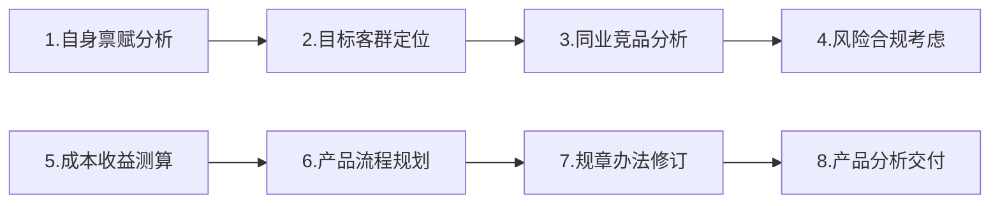

---
tags:
  - 产品设计
author: zhiminbai
date created: 2022-10-19 19:07
---

# 信贷产品分析过程

信贷产品是一个领域驱动的产品，在进行产品设计之前，需要先了解贷款产品的专业领域知识。
基于信贷产品知识[^note1]，对信贷产品架构进行设计。

## 一、设计原则

采用领域驱动（Domain-Driven Design，缩写DDD）)[^note2]的设计原则：

- 把项目的主要重点放在核心领域（core domain）建模和核心领域逻辑上。
- 把复杂的设计放在有界域（bounded context）的模型上。
- 领域模型是对业务模型的抽象，重点是把业务模型翻译成系统架构。

领域分析可以采用事件风暴的方式，业务专家列出所有的用户场景故事（场景可以通过6W来构建，即描写场景的 Who、What、Why、Where、When 与 How 六个要素)[^note3]。
列出用户场景后，产品专家对各个场景进行领域分析，最终以产品需求文档的形式进行交付，在团队内达成共识。

## 二、具体分析过程

### 1、分析过程说明

信贷产品的分析可以按照以下步骤进行分析：



### 3、自身禀赋分析

对企业、团队的自身禀赋进行分析，可以参考以下分类进行分析：

| 自身禀赋 | 禀赋说明                                                   |
| -------- | ---------------------------------------------------------- |
| 企业规模 | 客群定位、风险集中度考量的基本前提                         |
| 人力资源 | 包括展业人员数量、运维人员数量、风控人员数量、科技人员数量 |
| 科技资源 | 科技基础能力是否健全，科技创新导向是否清晰                 |
| 区域资源 | 分支机构布局情况及数量。城市，县域；境内、境外             |
| 经营成本 | 资金成本、操作成本、信用风险成本、市场风险成本             |
| 合作伙伴 | 股东优势、集团优势以及其他伙伴优势                         |
| 监管要求 | 监管规定会对信贷类的产品设计起到很强的导向和限制作用       |
| 文化导向 | 企业自身的文化导向也会影响整体产品规划与布局               |

### 4、目标客群定位

确定面向的客户，根据客群定位分析客户痛点，不同类别的客群采用的方案有所区别，如下所示：


	
### 5、同业竞品分析

同业竞品分析的主要关注内容

| 内容         | 说明                                                           |
| ------------ | -------------------------------------------------------------- |
| 同业市场份额 | 研究主要展业的银行和金融机构种类、各机构存量、新增市场占有情况 |
| 产品要素     | 确定产品的额度、定价、担保方式、收集材料要求                   |
| 客户整体口碑 | 客户反馈竞品体验的优劣处                                       |
| 主要产品形态 | 产品线下产品 or 线上产品、以及产品服务的主要细分客群           |
| 产品流程     | 线上界面及操作步骤、审批时效和环节                             |
|同业机构的比较优势|了解同业机构的比较优势所在|

同业竞品分析的主要获取方式

| 方式                   | 
| ---------------------- | 
| 咨询公司网站           |      
| 公开材料发布           |  
| 分析报告订购           |      
| 分析报告订购           |      
| 客户访谈               |     
| 自己使用               |      
| 同业及合作机构官网介绍 |      

###  6、风险合规考虑

信贷产品是强依赖于监管政策的，需要分析是否满足监管的要求，主要关注内容：

| 内容                 | 说明                                                                                |
| -------------------- | ----------------------------------------------------------------------------------- |
| 区域、行业及客群限制 | 区域展业限制、行业准入限制、客群准入限制                                            |
| 合作平台合规情况     | 合作平台监管处罚情况、合作平台产品模式合规分析                                      |
| 资料完备及真实性     | 授信主体的资料完备性、经营佐证资料的真实性                                          |
| 信息获取方式         | 获取客户信息类别、合作方征信资质、信息获取及授权方式                                |
| 资金流向控制         | 日常结算特点、自主支付贷后凭证搜集、受托支付流向监控、还款资金流控制                |
| 风险缓释准入         | 有效押品及押品登记、 接入方式、担保人资质及担保准入、押品处置便利性、保证金存取方式 |
| 规模及定价管控       | 信用风险成本估算、整体投放规模、不良监控及预警叫停计划                              |
| 消保及法审           | 协议文本、界面设计、分润方式、息费收取方式                                          |

###  7、成本收益测算

根据产品客群定位以及风险评估，进行风险定价，RAROC（风险调整后资本收益率）测算
```tex
RAROC=（净收益-预期损失）/经济资本

净收益=（外部利息收入+其他收入）-（资金成本+营销成本+税费成本+运营成本分摊+系统研发成本分摊）

预期损失=违约率(PD)×违约损失率(LGD)×风险敞口(EAD) 
(实操中有些同业以同类型客群或产品逾期或不良率替代)

经济资本=风险敞口(EAD) ×对应产品的经济资本分配系数
```


### 8、产品流程规划

信贷产品的业务流程设计一般按贷前、贷中和贷后进行设计

| 流程               | 设计要点                                                                                                                                                                     |
| ------------------ | ---------------------------------------------------------------------------------------------------------------------------------------------------------------------------- |
| 贷前线上流程 | 客户触达方式、用户界面设计、信息获取授权、操作流程                                                                                                                           |
| 贷前线下流程 | 客户触达方式、移动展业方式、下户采集资料、客户经理输机界面、信息复核机制                                                                                                     |
| 贷中线上流程 | 外部数据获取逻辑、风控调用机制、授信用信返回机制、合同文本及签署方式                                                                                                         |
| 贷中线下流程 | 审批流程设计、尽责审查要点、押品担保评估要点、额度及定价核定规则、合同文本及其他落实前提、出账审核要点                                                                       |
| 贷后流程           | 还款方式设计、贷后信息同步机制、监管报送、贷后约束条、归档流程、贷后检查频率及模板设计、现场回访流程触发规则、额度及押品重估年审、预警叫停机制、贷后运营机制、产品整体后评价 |

### 9、规章办法修订

| 办法             | 内容                                                                                                                      |
| ---------------- | ------------------------------------------------------------------------------------------------------------------------- |
| 办文依据         | 需注意所拟办法是否均在引用依据制度要求范围内                                                                              |
| 部门职责约定     | 明确岗位职责分工                                                                                                          |
| 客群准入要求     | 对于客群行业、规模、区域、客户类型、年龄或成立年限等进行约定合作方准入要求 涉及合作方的，明确合作方资质、规模、成立年限等 |
| 贷款要素约定     | 额度方式、期限、利率、金额、还款方式                                                                                      |
| 业务流程规范     | 贷前、贷中、贷后作业流程规范及采集资料规范                                                                                |
| 担保方式准入要求 | 押品范围、押品评估、登记落实；担保人资质                                                                                  |
| 运营管理要求     | 台账监控、账户开立、账务处理等                                                                                            |
| 预警叫停机制     | 预警线、叫停线，及相应预警后处理要求                                                                                      |
| 监管报送要求     | 报送机构、报送范围与相关规范等                                                                                            |
| 后评价机制       | 产品上线运营后的后评价机制                                                                                                |

### 10、产品分析交付

产品分析交付，需求文档的内容需要包括：

| 分类       | 内容                                                       |
| ---------- | ---------------------------------------------------------- |
| 产品要素   | 信贷产品的基本要素                                         |
| 流程设计   | 协议签约、信息授权、授信流程、额度激活、用信流程、还款流程 |
| 界面原型   | 前端和后管的界面原型                                       |
| 系统间交互 | 和上下游系统的系统交互逻辑                                 |
| 账务处理   | 会计分录、记账处理逻辑、账务文件交互                       |
| 贷后功能   | 贷后调额、风险预警、贷后检查与催收设计                     |


## 三、参考资料及拓展阅读
[^note1]: 信贷基础知识： https://shepherddog.github.io/wiki/finance/信贷基础知识/
[^note2]: 从MVC到DDD的架构演进： https://www.cnblogs.com/lesofn/p/15898137.html
[^note3]: Domain Story Telling： https://domainstorytelling.org/#dst-ddd
