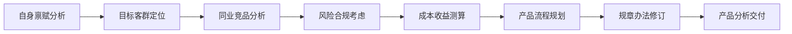

---
tags:
  - 产品设计
author: zhiminbai
date created: 2022-10-19 19:07
---

a wa# 信贷产品设计详解

信贷产品是一个领域驱动的产品，在进行产品设计之前，需要先了解贷款产品的专业领域知识。
基于贷款产品知识[^1]，对信贷产品架构进行设计。

## 1. 设计原则

采用领域驱动（Domain-Driven Design，缩写DDD）)[^2]的设计原则：

- 把项目的主要重点放在核心领域（core domain）建模和核心领域逻辑上。
- 把复杂的设计放在有界域（bounded context）的模型上。
- 领域模型是对业务模型的抽象，重点是把业务模型翻译成系统架构。

## 2. 领域分析

领域分析采用事件风暴的方式，业务专家列出所有的用户场景故事（user story, 场景可以通过6W来构建，即描写场景的 Who、What、Why、Where、When 与 How 六个要素)[^3]。
列出用户场景后，产品专家对各个场景进行领域分析，以需求文档的形式在团队内达成共识。

### 2.1  具体分析过程

**1. 自身禀赋分析**：对企业、团队的自身禀赋进行分析

| 自身禀赋 | 禀赋说明                                                   |
| -------- | ---------------------------------------------------------- |
| 企业规模 | 客群定位、风险集中度考量的基本前提                         |
| 人力资源 | 包括展业人员数量、运维人员数量、风控人员数量、科技人员数量 |
| 科技资源 | 科技基础能力是否健全，科技创新导向是否清晰                 |
| 区域资源 | 分支机构布局情况及数量。城市，县域；境内、境外             |
| 经营成本 | 资金成本、操作成本、信用风险成本、市场风险成本             |
| 合作伙伴 | 股东优势、集团优势以及其他伙伴优势                         |
| 监管要求 | 监管规定会对信贷类的产品设计起到很强的导向和限制作用       |
| 文化导向 | 企业自身的文化导向也会影响整体产品规划与布局               |

**2. 目标客群定位**：确定面向的客户，根据客群定位分析客户痛点

![[信贷产品目标客群定位.png]]
	
**3. 同业竞品分析**：收集市面上的竞品，结合团队/公司的情况进行比对分析

**4. 风险合规考虑**：信贷产品是强依赖于监管政策的，需要分析是否满足监管的要求:

**5. 成本收益测算**：根据产品客群定位以及风险评估，进行风险定价，制定规模目标（贷款余额、利润、不良率），制定人力成本和营销推广计划

**6. 产品流程规划**：信贷产品的业务流程设计

     
**7. 规章办法修订**：针对市场风险、行业风险、操作风险、信用风险、欺诈风险等进行风险评估。

**8. 产品分析交付**：针对市场风险、行业风险、操作风险、信用风险、欺诈风险等进行风险评估。

### 2.2 领域分析的输出物

**1. 产品要素**

信贷产品的基本产品要素主要包括：

| 要素       | 举例说明                     | 要素       | 举例说明                       |
| ---------- | ---------------------------- | ---------- | ------------------------------ |
| 产品类型   | 个人消费贷款、个人经营贷等   | 贷款对象   | 学生、个体工商户、国企公务员   |
| 额度类型   | 循环额度、单笔发放           | 额度范围   | 1~20万                         |
| 授信有效期 | 不超过1年                    | 前置条件   | 黑名单、地区准入等             |
| 审批方式   | 授信线下审批、放款线下审批   | 担保方式   | 信用、保证                     |
| 利率定价   | 客户融资利率范围，比如5%~10% | 还款类型   | 等额本息、到期一次还本付息     |
| 还款方式   | 线上还款、线下还款、批扣还款 | 收费结构   | 本金->利息->罚息               |
| 增信措施   | 融担公司 、保险公司          | 反欺诈策略 | 依据设备位置等信息监控操作场景 |

**2. 业务流程**
	

 **3. 领域划分**

## 3. 领域建模

## 4. 核心业务逻辑

## 参考资料
[^1]: 信贷产品介绍： 
[^2]: 从MVC到DDD的架构演进： https://www.cnblogs.com/lesofn/p/15898137.html
[^3]: Domain Story Telling： https://domainstorytelling.org/#dst-ddd
