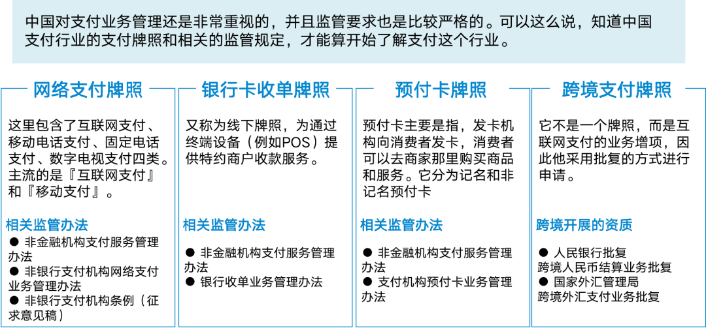
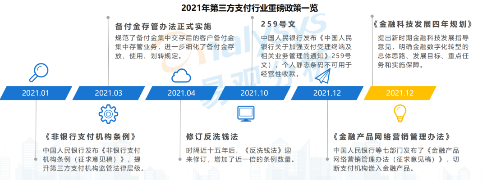
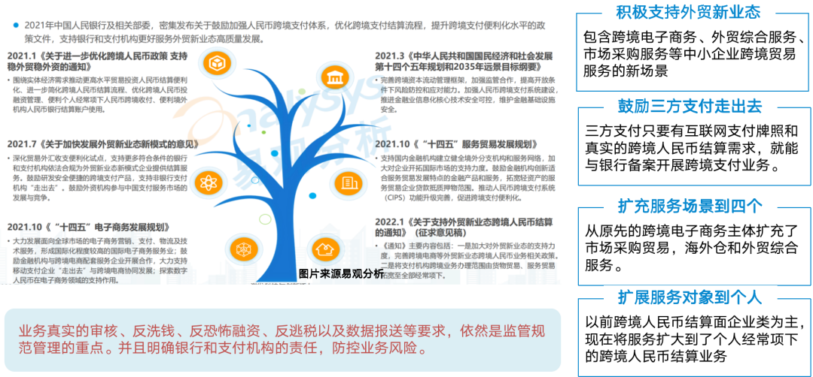
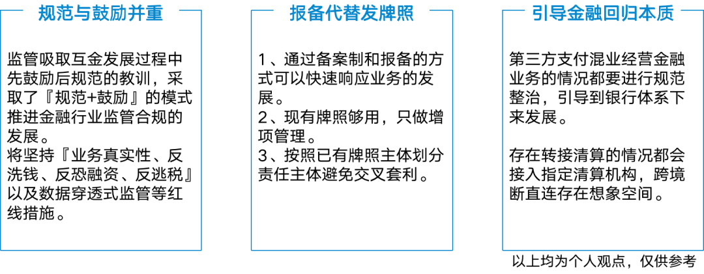

# 支付领域简介

本文提供了解支付行业的较为完整的指引：

##  一、支付牌照的分类

图1：中国支付牌照分类和相关管理办法

中国对支付业务管理还是非常重视的，并且监管要求也比较严格。同时支付业务的开展，支付产品的建设都是基于牌照许可范围和监管规定来实现的。可以这么说，**知道中国支付行业的支付牌照和相关的监管规定，才能算开始了解支付这个行业**。

支付牌照是指第三方支付牌照，他主要分为三类许可证和1个业务增项，他们以相应的管理办法、条例、通知等形式来进行监管。

### 1.1 非金融机构支付管理

《非金融机构支付管理办法》是第三方支付业务2010年出台的一部业务管理办法，由于当时三方支付牌照还没下发，因此这个管理办法主要是针对第三方支付的牌照分类、申请、监管、处罚给出了框架性的规定。给随后牌照发放，持牌机构管理办法出台提供了纲领性的指导。

### 1.2 支付业务许可证

支付业务许可证[^1]，又称为三方支付牌照，是由中国人民银行颁发的非金融机构从业资格证书[^1]，按照《非金融机构支付服务管理办法》对牌照的划分，每类牌照还有细分的管理办法。

**1）网络支付牌照：**

又称为线上牌照，这里包含了互联网支付、移动电话支付、固定电话支付、数字电视支付这4种牌照，其中『互联网支付、移动电话支付』牌照最为普遍，而固定电话支付、数字电视支付则已经很少在使用了。

主要监管条例如下：
-   非银行支付机构网络支付业务管理办法 [^3]
-   非银行支付机构条例（征求意见稿）[^4]
    

**2）银行卡收单牌照：**

又称为线下牌照，指持卡人通过终端设备（POS机具）进行刷卡消费的业务。当然现在的银行卡收单牌照也包含了线下的码牌扫码、扫码枪、扫码墩的收款业务。

需要指出的是银行卡收单牌照是有区域限制的，比较热门的是受理范围包含"全国"的牌照。而之前京东支付（网银天下）之所以要收购快钱就是因为它原有牌照的受理范围仅包含北京地区，所以要斥巨资来收购快钱的『全国』牌照，可见受理范围有多重要。主要的监管条例是《银行收单业务管理办法》 [^5]。

**3）预付卡发行与受理牌照**

预付卡分为『记名预付卡』和『不记名预付卡』两种，我们常见的『美容美发卡』、『健身卡』等需要登记姓名和持卡人预付充值的都是『记名预付卡』。而逢年过节作为礼品赠送的『超市购物卡』一般都是『不记名预付卡』。

相关的监管条例如下
-   支付机构预付卡业务管理办法 [^6]
-   关于进一步加强预付卡业务管理的通知[^7]
    
### 1.2 跨境人民币结算

这不是一个牌照，而是互联网支付牌照可以申请的一个增项，因此它以批复函的方式进行准入。****申请跨境支付要经过人民银行、国家外汇管理局两个部门的审批才能开展跨境人民币的支付业务**。

-   申请的牌照
-   人民银行批复：跨境人民币结算业务批复
-   国家外汇管理局：跨境外汇支付业务批复
    

别小看这两个批复文件，虽然他们只是互联网支付业务的增项，但是他们审批的难度一点都不比支付业务许可小。**现有118家互联网支付公司仅有27家申请增项成功**。当然随着22年6月份后『中国人民银行关于支持外贸新业态跨境人民币结算的通知』[^8]的发出，三方支付走出去将变得更加方便和灵活。

## 二、支付行业的历史

了解了支付牌照和相关的监管规定，我们再来看下中国支付行业的历史，通过历史我们来了解中国支付体系的整体格局、产品演变，以及未来发展方向。

图2：支付行业发展发展历史和产品演变

### 2.1 支付的缘起（2000年-2010年）

支付缘起于银行『存、贷、汇』三大业务的『汇兑』业务，早期的银行汇款需要收款和付款人在同一家银行，汇款人要在柜面开汇款单，收款人收到所在银行网点通知后去银行兑付资金。

随着银行卡的普及，在2002年中国银联成立，并且在2004年推出ATM、POS收单业务，用户可以在银行自助终端上完成跨行存取款，并且银行卡也能在开通特约商户的商超、门店进行刷卡支付。

收单这个词，就来源于用户刷卡支付后商家保存用户的签字回单签字的行为，现在这个词普遍被用于通过银行卡向商家付款购买商品、服务的消费行为。（从监管规定上来说，通过账户余额支付并不算收单，属于转账消费，但是人们日常中也将此统称为收单或者消费）

与此同时，2000年左右为了解决电子商务业务中的资金问题，环迅支付和首信易支付2家企业成为首批提供第三方网上支付平台的企业。随后支付宝也相继加入了支付企业的行列。**此时，由于阿里巴巴还没有找到电子商务成功的商业模式，因此互联网支付并没有得到广泛的使用。主要是固定电话支付、有线电视购物的支付。此时这些支付企业并没有得到真正的牌照。

#### 2.1.1 2006年支付宝卡通横空出世，奠定了网上支付的基础

**2.1.1.1 行业层面，淘宝推动电子商务模式落地**

2006年，淘宝商城推出的担保支付模式，极大促进了互联网支付需求的兴起。而在2011年之前三方支付牌照还没有下发的时候，阿里为了给用户提供更好、更便捷的支付体验率先推出了『支付宝卡通』产品。

**2.1.2.2 产品层面，支付宝卡通产品推动网上支付**

支付宝卡通是个非常大胆而富有创新的产品，它通过平台到银行开通备付金账户为平台上的用户提供了网上支付服务。此时的卡通产品还是借鉴了成熟的银证开户模式。业务刚推广时，用户需要先到银行柜面申请开通『开通服务专项卡』然后在淘宝商城或者支付宝完成绑卡与激活，同时支持用户绑定多个银行的卡。

网上支付链路打通后，通过淘宝商城巨大的流量『卡通』的用户绑卡量快速地占领了市场，支付宝也顺势超越以线下银行卡收单为主要的『银联』成为了支付市场新的王者。

这个时期配合支付宝『卡通』的银行**B2C网关也逐步成熟，推动了银行网关支付的发展**。在此基础上面向企业的B2B网关和企业网银也随后被推出。

### 2.2 行业的诞生（2011年-2012年）

#### 2.2.1 第三方支付牌照颁发，支付真正成为了一个行业

**2.2.1.1 行业层面，监管密集的支付牌照发放**

这年之所以被称为三方支付元年，是因为经过多年的试点和互联网业务的蓬勃发展，给三方支付发牌照的呼声也越来越高。因此，2010年6月央行对外公布了『非银支付机构服务管理办法』提出对第三方支付企业进行监管。

2011年5月-2011年9月人民银行正式向第三方支付机构颁发『支付业务许可证』，我们现在看到绝大部分支付牌照都是在这段内申请到的，可见当时人行对于三方支付鼓励的态度。**此时支付不再是一个收付款的工具和网络，而真正的成为了一个可以面向市场开展商业活动的行业。**

**2.2.1.2 产品层面，快捷产品推出奠定移动支付基础**

支付产品建设方面，支付宝为了提升用户网络支付的体验，让用户不再要去线下银行柜面绑卡。在支付宝卡通的基础上创造性的推出了『支付宝快捷』，它只要通过输入『姓名、身份证、手机号、银行卡』这四个要素，通过一个短信验证码就能完成用户的绑卡和激活。

现在快捷支付已经是一个互联网支付的标配了，但当时该产品推对银行业的挑战还是非常大的，银行认为**『用户跳过银行的支付终端进行支付，是不是动了银行的奶酪呢？另外用户都不需要到柜面上来验证身份通过一个短信验证码就完成绑卡，出现盗卡、盗刷风险该怎么办呐？』**。

为此，支付宝为了打消用户在资金风险上的疑虑『提出了先行赔付』并且赠送『资金保险』的做法。而对于绕开银行支付终端的问题，支付宝抓住重点与五大行之首的工行坐下来逐一进行谈判，充分地分析和平衡了合作关系、以及利益分配**。最终，与工行达成协议落地了快捷产品，通过工行建立的标杆效应，以及支付宝的流量、资金和推广优势，迅速地实现了支付宝快捷产品的推广。**

**同时，快捷产品的推出，也是为支付宝筹备已久移动支付王牌产品『扫码支付』进行了提前布局**。

### 2.3 支付的鼎盛（2013年-2016年）

### 2.3.1、互联网金融元年，支付和金融市场空前开放，同时乱象也开始滋生

**2.3.1.1 行业层面，政策鼓励下互联网金融连续性创新**

 13年作为互联网金融的元年，互联网金融相关的创新事件层出不穷。其中对支付行业影响比大有这么几件事情。

1. 支付的改变：支付宝扫码支付推出，通过手机进行网上支付、扫码支付成为了主流。支付方式革新也改变了人们的生活方式。
2. 存款的改变：余额宝产品推出，原先没有用户利息的支付账务有了超过银行活期的利息，用户大量的将银行卡里的钱去购买余额宝，用户的存款行为得到了改变。
3. 消费的改变：『民营银行银行牌照』下发后，支付宝推出的花呗、借呗、芝麻分，让用户通过信用就能申请到信贷额度，进行提前消费。
4. 社交的活跃：2014年-2016年春节，微信通过红包大战绑卡用户量一举反超支付宝，形成了支付行业两强争霸，微信占有的局面。通过微信发红包、转账、AA收款、扫码支付等方式也改变了人行的社交方式。
5. 投融资的多元化：P2P网络平台遍地开花，点对点的投融资模式改变了人民投资和融资渠道的多元化。

    如果说前面的一些机会都是给头部的微信、支付宝生态的机会。**那P2P热潮给其他第三方支付机构带来了难得一遇的发展机遇。**

**2.3.1.2 产品层面，移动支付产品成型，支付产品空前繁荣**

借助互联网金融的热潮，支付产品的连续性创新层出不穷，市场的需求也得到了充分释放。

-   **支付钱包，支付与金融完成打通，塑造平台闭环生态**
由于支付宝增加了余额宝，支付账户的用户粘性也增加了，非常有利于打造平台自己的闭环生态。因此，很多支付公司与银行、基金公司合作推出了具有理财功能的支付钱包产品，输出给其他互联网平台来打造自己的闭环生态。

-   **认证支付，市场、产品、风险的进一步细分**
这是将快捷和裸代扣进行包装后对外输出的产品，他是对快捷产品的进一步细分，主要体现在额度、适用场景方面对支付产品的细化。一方面来满足客户需求并控制风险，另一方面也能更好提升产品的利润。

-   **移动支付产品家族成型，支付宝/微信的生态价值爆发**
通过支付宝、微信推出了『扫码支付、钱包支付、公众号支付、小程序支付』的系列移动支付产品，借助其良好的支付体验和强大的生态创新能力，O2O市场需求得到了充分的挖掘，也使得中国移动支付跨入了世界领先行列。

**2.3.1.3、支付的乱象逐渐显现**

移动支付和互联网金融的爆发式增长，给支付带来繁荣的同时一些乱象也开始逐步出现。

-   **裸代扣，其他三方与巨头抗衡的支付资源**

随着以P2P为代表的互联网金融的兴起，提供用户自动还款的银行裸代扣产品受到热捧。因为，裸代扣只需要用户输入四要素就能进行自动扣款，因此体验比『快捷支付』还要好，加上它按笔收费成本更低、额度更大等特点。中小三方支付与支付宝/微信相抗衡的重要金融资源。

一开始，裸代扣产品以银行本代本通道（既向本行开卡用户收款）为主，但是市场巨大的需求基于银联、各地清算中心、银银平台的本代他（既本行可以向他行开卡用户收款）的扣款产品业务被推出来了，这些很多都是清算体系内部接口，没有对用户进行签约和实名认证就能扣款。

-   **扫码反接盛行，分享移动支付的红利，也造成了鱼龙混杂的情况出现**

看到活跃的移动支付市场，其他三方支付公司也想分享扫码支付的红利。但是由于三方之间是不能进行直连，因此，扫码反接就出现了，所谓的扫码反接就是通过银行与支付宝/微信这样的三方支付公司进行对接，然后把产品输出给其他三方支付扫码支付产品，在这过程中银行扮演了转接清算的角色。正接和反接的比较见下图。

图2：扫码正接和反接

扫码反接的出现一方面给三方提供了扫码支付的产品，让三方也享受到了微信、支付宝生态带来的红利，另一方面也开始出现鱼龙混杂的情况。巨大的市场需求催生了**四方也加入其中，通过为银行提供技术服务实际承担了代理转接清算的工作。此时灰色交易横行，市场进入了一个野蛮生长的阶段**。

-   **P2P存管产品，为账户托管和金融SaaS服务奠定基础**
在账户产品方面，由于P2P的盛行，三方支付作为持牌机构也推出了基于支付账户的『第三方支付网贷存管』产品，以及与银行一起进行监管『网贷联合存管产品』。基于监管16年《网络借贷资金存管业务指引（暂行办法）》中P2P需要存管和备案的要求，三方也开始成为银行的技术服务商为银行提供P2P的存管服务。

后来随着，监管要求P2P网贷全面清退，P2P存管这个产品也退出了历史舞台。但是，**三方以技术服务商的形式为银行提供金融科技服务的『金融SaaS服务模式』**，由于它能够帮助中小银行解决场景能力开放、客户服务响应、商户营销/拓展、大数据风控等方面的服务能力，因此这种模式依然得到了保留，在互联网电商、门店收银、平台金融、企业交易平台等方向上继续得到了发展。

### 2.4 支付的规范（2017年-2020年）

鼓励但缺少规范的监管方式，在推动市场的创新的同时也滋生了灰产、暴力催收、网贷暴雷等情况的发生。随着国家『金融出清』的态度逐步明确，支付作为各大商业生态的资金来源，自然加入了金融监管整治的行列。

#### 2.4.1 2017年12月：打击二清专项整治，拉开金融监管序幕

**2.4.1.1 行业的层面，连续发文监管直指二清、直连、反接、垄断等违规行为**

2017年底监管连续发了3个非常重要的文件，分别从二清、规范创新、条码规范三个方向进行集中整治，监管对于行业乱象观察之通透，细节要求之详细，打击之精准让业界为之振动。并且，对后续监管步骤的推进产生了深远的影响。相关的主要几个文件的重要意义如下：

-   **217号文《中国人民银行办公厅关于进一步加强无证经营支付业务整治工作的通知》**[^8]

 给出了明确的二清的定义，并将信息二清也纳入了自查的范围。并且对支付结算过程中的所有参与者提出了自查和整改要求。该文主要针对，支付反接、转接清算、底层清算开放为裸代扣、商户代收资金等方式给灰产、电信欺诈、暴雷跑路提供支付便利的情况。

-   **281号文《关于规范支付创新业务通知》**[^9]
    
这个给创新加上了『规范』二字，实际含义是支付创新的约束，他在『反垄断』和『禁止三方、银行之间转接清算』方面提出了明确的要求。同时『存量业务要尽快迁移人民银行规定的合法的清算机构处理』的要求，断直连的想法呼之欲出。

-   **296号文，中国人民银行关于印发《条码支付业务规范（试行）》的通知** [^10]
    
该文主要是针对支付宝、微信两家巨头的条码支付产品进行了规范。同时也对其他三方支付机构开展的条码支付牌照范围进行规定。**与之相关的扫码反接的支付市场也随之退出历史舞台。**

**2.4.1.2 产品的层面，三方/银行推出账户产品解决二清**

与政策对应，此时三方支付、银行开始推出关于『支付二清』相关的解决方案。

-   **收单分账产品**
    
该产品主要面向平台型的电商解决『资金二清』问题，以及给小商家提供技术服务的四方解决『信息二清』的问题。详细内容参看《[收单分账产品详解](http://mp.weixin.qq.com/s?__biz=MjM5MDIwNjAxMA==&mid=2247483805&idx=1&sn=ac55ebb336b64b74858b1a0506225a59&chksm=a64910c8913e99de55919af537e99e43e34722f746df9510d7ef3597a777b4fb5db786e07d70&scene=21#wechat_redirect)》

-   **商户钱包产品**
    
客户定位主要是闭环场景的电商平台的资金二清问题，该产品与P2P存管产品思路一脉相承，先通过三方支付托管的方式完成中小平台账户托管。针对大型平台则以技术服务商的方式与银行进行合作。详细内容参看《[商户钱包产品详解](http://mp.weixin.qq.com/s?__biz=MjM5MDIwNjAxMA==&mid=2247484076&idx=1&sn=f30b49ddb2872f5f23c7781fd1f51a26&chksm=a64913f9913e9aef3785791c374823b40d2e1dee5203d3601c1013c2c038e3ccdf4e76786609&scene=21#wechat_redirect)》。

-   **交易见证产品**
    
这是银行提供的二清解决方案，由于银行的银企账户需要柜面开户，因此，其底层账户采用了虚拟账户技术。同时虚拟账户的类型不在人行明确的结算账户之列，因此这类账户要通过报备的方式才能开展业务，所以推广的不如三方普遍，一般以底层账户服务的形式提供给商家或者三方接入。详细内容参看《[交易见证产品详解](http://mp.weixin.qq.com/s?__biz=MjM5MDIwNjAxMA==&mid=2247484300&idx=2&sn=0711b6e6abe155760bbb07e9b7404f21&chksm=a64912d9913e9bcf8594caab2357fee747666309e11752ff012e0f640b873ec0f4a9ffb1c1f2&scene=21#wechat_redirect)》。

#### 2.4.2 2018年-2020年，断直连工作开展，四大举措重塑监管格局

2018年到2019年，114号《关于支付机构备付金集中缴存有关事宜的通知》发出后，宣告断直连工作正式开始。同时与之配套的统一清算、监管上报、反洗钱检查等工作全面展开，通过对三方、银行、银联等机构的规范化整治，中国监管格局完成了重塑。

**2.4.1.2 行业的变化，穿透式监管三方全面走向规范**

针对该通知，监管不仅仅是进行断直连和缴存工作，而是无死角的系列组合拳。

-   **三方断直连和集中缴存同步进行**
历时一年所有第三方支付机构全部纳入了网联、银联两大三方清算体系，原先三方与银行谈判的重要筹码『备付金』也全部集中缴存到了人行的ACS账户（全称，中央银行会计核算数据集中系统账户）。

-   **统一清算，跨行清算全部上收到总部机构**
既原先银行、银联等具有跨行清结算资质的机构，是可以由各地分支机构开展的，但是统一清算后这些跨行清算服务全部上收到了总部机构进行统一管理。对通过各地分支机构合作跨行清算的漏洞进行了封堵。

-   **监管上报，进行事后的穿透式监管**
断直连、集中缴存、统一清算，人行只能看到资金层面的收付，并不能监控到通过业务场景端进行信息二清的情况。因此，人行要求第三方支付机构对于交易数据进行监管报送，主要报送的内容包含『所有客户账户的开户信息，客户账户的每日余额，所有账户之间的收支交易明细等』。通过人行备付金的总账与三方报送的明细，**监管通过大数据挖掘分析就可以清晰掌握通过每个人在三方开展的每一笔交易的情况，同时这些数据也成为了全民大数据的基础。**

-   **反洗钱全面铺开至今**
断直连系列工作完成后，人行开展了持续至今的针对、三方、银行、银联等持牌机构反洗钱现场和非现场检查的工作，这里面出了系列的反洗钱措施，从支付接口、账户、资金处理、交易安全、信息保护进行了全面的清查。以2020年出45号文为例，就包含了40个摸排项，123个摸排要点。对可能遗留的、或者有疑问的业务进行了无死角的全面清查。

**2.4.1.2 产品的变化，网联/银联标准产品成为基础**

断直连后互联网支付公司全面使用网联、银联的标准支付产品。原先直连时代一家支付机构拥有几十甚至上百条支付通道。断直连后支付公司只需要接入网联、银联两条通道即可，从支付稳定性、质量上提升了不少，但是由于三方和银行直接的利益被打断，支付成本明显提升。断直连后标准的支付产品如下

-   **快捷类产品：主要指先绑卡激活，然后支付时进行扣款的支付方式。**网联：协议支付(小额)、商业委托收款(大额)；
    
-   银联：银联新无卡(小额)、银联新代收(大额)；
    
-   **网关类产品，通过桌面浏览器和手机跳转到银行端网关进行支付方式。**
    
Pc网关产品，名称网联和银联差别不大，主要是面向个人的借记卡、信用卡的B2C网银，面向企业的对公账户的B2B网银支付产品。

移动网类产品，银行推出了与支付宝、微信的App支付类似的B2C网银产品。

-   **条码类产品**
    
条码支付主要是微信、支付宝两家平台的扫码、公众号、小程序支付。这里面微信、支付宝虽然不是发卡行。但是由于其巨大的移动支付的用户占量，因此他作为账户侧接入网联银联给三方支付、银行提供条码支付产品。

当然，两家巨头并不愿意把用户拱手相送，因此，它们没有提供完整的移动支付产品能力。造成三方支付、银行在微信、支付宝生态外的APP、H5支付都是有缺陷的。相关内容参看我的《[垄断者的奇技淫巧](http://mp.weixin.qq.com/s?__biz=MjM5MDIwNjAxMA==&mid=2247483682&idx=1&sn=de30eec41f8a5eaa71d9b654afb73032&chksm=a6491077913e996197c048a3a473d1c76968f63606ca6b3ab66c9846495305443f8bcc9f8857&scene=21#wechat_redirect)》，大家在对接间联渠道的条码支付防止踩坑。

### 2.5 支付的重生（2021年-至今）

#### 2.5.1 国内三方支付规范化发展

图3：2021年的监管相关规定（图片来源易观）

**2.5.1.1 行业层面，国内规范闭环，海外鼓励发展的双循环格局**

-   **《非银支付机构条例（征求意见稿）》**[^4]
    
这相当于未来对于三方支付机构的进行管理的『新的基本法』，里面比较重要的是重新规范了第三方的账户，其中原有的『支付账户』定义中没有涵盖『企业客户』这个类型，业内为此产生了很多的联想。

其次，是对从事支付技术服务的四方支付（文中称为『支付信息服务机构』）明确的提出了要通过支付清算协会进行『支付信息服务机构备案』的要求，并且，支付的数据要向清算协会全部放开，接受清算协会的监督。

-   **259号文，《人民银行关于加强支付受理终端及相关业务管理的通知》**[^11]
    
针对线下终端支付渠道，人行发行的259号文，明确要求终端支付机具（POS机、自助终端）等需要五要素关联（收单机构代码、特约商户编码、商户信用代码证号、摆放地理位置），而无法获得位置信息的码牌要求四要素关联。

另一个比较重要的是该文提出了『**个人静态码不可用于经营性收款』，由此行业内特别是银行兴起了一股换码营销的热潮。不过后来监管通过支付清算协会发文『新设个人经营收款码，用户可以自由选择，原个人收款码不关闭、不停用**』，换码潮就就此热度骤减。

   **至此，第三方支付从终端渠道、信息服务、支付结算服务全部纳入了人行的监管视野之内规范发展。**

-   **《金融产品网络销售管理办法》**[^12]
    
对于我们在支付时使用余额宝、花呗等金融产品进行支付的行为明确提出了『非银行支付机构不得为贷款、资产管理产品等金融产品提供营销服务，不得在支付页面中将贷款、资产管理产品等金融产品作为支付选项，以默认开通、一键开通等方式销售贷款、资产管理产品等金融产品』，掐断了支付过程中内嵌金融产品的情况。

不难看出，监管对于支付过程中的金融产品整治的决心，而不在此规定范围内银行迎来了空前的发展良机。

**2.5.1.2 产品层面，场景和银行结合提供科技服务输出**

随着监管对于国内三方支付闭环规范管理，以及收单外包制度的推出。国内三方支付产品的发展逐步转向与银行进行合作的金融科技服务的方向上。通过收单外包备案的形式与银行展开直连合作，为商家提供完整的金融服务。

-   **SaaS账户服务：**
    
通过与银行合作拓宽了支付账户金融方面的局限性，增加账户存款收益、理财、信贷、权益产品服务的输出。这类产品主要提供给大型电商、企业交易平台等用以构建自己的用户生态。

-   **商家收银服务：**
    
这类产品主要面向零售门店、餐饮小商家，以及菜场、超市小商贩等。在收单分账产品的基础上，为他们提供收银、结算、进销存、小程序商城、社群服务等一站式的SaaS订阅服务。这类服务提供者包含了原有的四方支付、以及后加入的三方支付，他们通过积累的生活圈商户和数据优势与银行开展合作，通过金融服务输出实现变现。

-   **闭环场景智能终端服务：**
    
面向企业、学校、医院、园区、停车场等闭环场景，提供食堂刷脸支付、医院诊间支付、园区自助售卖机等智能终端类的支付服务。这类服务提供者以四方支付、传统软件供应商这些在垂直行业深耕多年，掌握着相关资源的服务商为主。通过与银行一起进行商户拓展，通过金融、营销服务的输出实现商业变现。

三方进行金融科技服务输出的案例很多，早期主要围绕支付服务的输出，将三方、银行的资源整合在一起服务不同垂直场景的商家和用户。

现在围绕不同场景的数字化服务输出则更为丰富，包括私域营销服务、商家经营管理等，也包括给银行提供风控服务防止营销过程中的薅羊毛、刷单等交易欺诈行为。

#### 2.5.2 跨境支付积极鼓励

图5：跨境支付相关的监管政策（图片来源易观，信息来源综合各方信息）

与国内三方支付全面的规范化管理不同的是，跨境支付正处于一个积极鼓励的阶段，同时监管吸取了国内支付发展过程中的教训，在鼓励的同时也对银行、支付机构的『开展形式、合规合法性、定期评估、以及相关的责任主体』等方面提出了明确的要求。分析下来主要有以下几点新的动向

**1）积极支持外贸新业态**

所谓外贸新业态，是指与传统外贸业务相比，具有小额、海量、电子化特征的外贸业务，根据根据外汇局《关于支持贸易新业态发展的通知》[^8]，外贸新业态主要包括以下模式『跨境电子商务、外贸综合服务、市场采购服务』，这也符合中国私营企业、中小微企业作为外贸主体的实际情况。

**2）鼓励三方支付走出去**

从事跨境人民币结算的支付机构，只需要取得跨境互联网支付牌照并且有真实的跨境人民币结算需求，就可以与具有跨境人民币结算资质的银行以备案的形式开展业务。**对『三方支付走出去』形成了积极引导**。

**3）拓宽跨境服务对象到个人经常项下**

以前跨境人民币结算面向企业类为主，现在将服务扩大到『个人消费者、新业态经营者』增加了服务对象，这样银行和支付机构可以为个人交易主体提供经常项下的跨境人民币结算服务。

**4）拓宽了服务场景到4个**

从原先的跨境电子商务主体扩充了市场采购贸易，海外仓和外贸综合服务，服务场景的扩大可以更好促进实体业务走向世界。

**5）合法合规的开展结算业务依然是重点**

业务真实的审核、反洗钱、反恐怖融资、反逃税以及数据报送等要求，依然是监管规范管理的重点。并且明确银行和支付机构的责任，防控业务风险。

    由此可以看到，鼓励支付机构走出，鼓励中小微企业实体经济走出去发展外贸新业态是国家重点鼓励的方向。

## 三、支付的监管趋势

图6：支付的监管趋势

相关内容是我个人对监管合规的一些理解，内容仅供参考，不做评价。请看图片。

## 四、行业当下的热点

图7：行业当下的热点

### 4.1 国内支付坚持规范发展

国内支付行业的发展依然坚持规范化反正和反垄断的道路，鼓励通过新技术向小微商户、实体经济、绿色经济、乡村振兴等国家战略目标进行发展。**对于业务发展停滞或者没有实质业务的三方支付公司采取主动退出和中止续展的方式收回牌照**。

### 4.2 积极鼓励数字人民发展

数字人民币是国家普惠金融、人民币国际化发展的大战略方针，因此还是积极鼓励的。由于数字人民币还在试点阶段，现在运营方式还是以十家运营机构的推广为主，对于2.5层的代理运营机构开放度不够，因此商业模式上也不够清晰。

当然现在还是在试运营阶段，数字人民币在系统稳定性、支付体验、易用性方面还有很多短板要去补足。相信未来会有更加开放、灵活的形式推广出来。

    这方面主要的银行有，邮储、工行、建行、交行等运营机构。

### 4.3 积极鼓励跨境支付结算

政府和监管密集发文可见国家对于跨境支付支持外贸新业态态度的积极性。需要关注的是跨境支付行业头部聚集效应明显，新加入的支付机构需要有更加细分领域的优势才会在跨境和海外支付市场上分得一杯羹。否则备案制关停、撤销业务也是非常灵活的。

现阶段主流开展的也包括货贸出收付款、服务贸易缴费、新业态货贸服务、新业态个人经常项、全球收付款、全球缴费与运营等业务。

这方面的国内跨境支付比较领先的有，连连国际、联动优势、支付宝等。

### 4.4 金融科技输出中小银行

银行属于人力密集型和资金密集型总资产企业，因此，通过数字化转型实现银行轻资产运行，提高银行用户的交易体验、服务响应速度、业务运行效率以及风险防控能力是非常有必要的。

现在数字化转型大行开展的比较领先，但是中小银行由于经济能力、人才培养、业务规模等多方面的限制影响了数字化转型开展的。因此，具有金融科技能力和占有商户数据、交易数据的三方支付机构，可以通过收单外包备案，金融科技公司的方式与中小银行开展合作帮助中小银行完成数字化转型。

**当然，这个过程中金融科技公司与银行之间的商业模式的构建是合作成败的关键**。现阶段适合开展的产品和服务有『数字化商户营销、数字化商家运营管理、聚合权益服务、智能风控、助贷业务』等。

这方面主要的公司有，京东科技、汇付天下、宝付、ping++等。

### 4.5 产业支付发展方兴未艾

企业数字化转型也是近年来的热点之一，支付技术服务商以『企业金融SaaS服务』的方式与银行合作。把支付和银企服务、供应链金融结合在一起，为企业提供线上化『支付+账户+金融』的综合服务。支付技术服务商可以基于其技术服务能力提升银行客户服务的响应效率、服务质量。也能通过其商户、交易数据的优势为用户提供小微商家的私域营销、经营管理等SaaS增值服务。

这方面主要的公司有，收钱吧、有赞、连连支付、宝付等。

## 五、支付就业的建议

看到这里大家应该知道，支付是一个比较成熟的行业了，特别是国内支付行业处于一个衰落后重生的一个阶段。同时支付作为一个数字化建设的基础能力，它与线上化、交易、财务、金融有着紧密的联系。并且支付数据也是金融大数据的基础。

### 5.1 去大厂

由于大厂的场景比较丰富和多样化平台数字化能力要求高。可以从事与场景结合的支付产品经理，与履约结合的交易产品，与资金相结合的结算产品。也能拓展到数字化营销、智能风控、数字化运营等岗位。

大厂对于学历、年龄、底层思维能力要求是比较高的，入职初期工作压力也比较大。

### 5.2 去银行

近年来监管政策明显利好银行支付业务的发展，银行由于长期作为互联网公司的底层能力平台，因此他整体结算能力交强，但是支付的场景化做的比较薄弱。因此，在银行成为银行的收单支付产品、交易产品、风控产品经理比较适合。

银行对于学历、年龄的要求是比大厂高的，薪资收入方面也不如大厂，但工作压力略小于大厂。

### 5.3 去企业

企业数字化必然需要交易线上化和业务数字化的过程，特别是国企、新兴行业龙头企业、垂直行业龙头企业等，他们壁垒比较高，也需要数字化转型来支撑其业务体系。业务需要支付、结算的产品经理。企业的支付产品经理将更多的与线上交易、财务结算、三方/银行渠道、供应链金融相结合。

比较大型的企业和线上化平台，需要独立的支付和结算产品经理。他们更多的是关注求职者的岗位专业能力和岗位匹配度。

### 5.4 去海外

通过前文的分析我们也可以看到，跨境支付、海外支付支持外贸新业态是近年来国家比较鼓励的方向，支付作为贸易的铺路石，也有着比较广阔的市场需求。跨境和海外支付产品经理，除了需要专业能力以外，对于英语也是有一定的要求的。

最后，希望从事支付行业，或者正在从事支付行业的支付从业者，在做支付的同时，还需要重点关注业务场景、数据资产、新技术的运用等方向。

始于支付，不要止于支付，数字化才是当下和未来最大的潮流。

---

## 支付管理政策汇编

[^1]:支付业务许可证：来自百度百科『支付业务许可证』

[^2]:非金融机构支付服务管理办法: http://www.gov.cn/zhengce/2016-05/24/content_5076138.htm

[^3]:非银行支付机构网络支付业务管理办法:http://www.gov.cn/xinwen/2015-12/28/content_5028628.htm?from=androidqq

[^4]:非银行支付机构条例（征求意见稿）:http://www.gov.cn/xinwen/2021-01/21/content_5581574.htm

[^5]:银行收单业务管理办法http://www.gov.cn/gzdt/2013-07/10/content_2444539.htm

[^6]:支付机构预付卡业务管理办法http://www.pbc.gov.cn/tiaofasi/144941/3581332/3586933/index.html

[^7]:中国人民银行关于进一步加强预付卡业务管理的通知http://www.pbc.gov.cn/zhifujiesuansi/128525/128535/128623/2811530/index.html

[^8]:中国人民银行办公厅关于进一步加强无证经营支付业务整治工作的通知（银办发〔2017〕217号），移动支付网转载，https://www.mpaypass.com.cn/download/201712/18162417.html?_d_id=ec8a9ff54af5f308751f232d44f3e2

[^9]:关于规范支付创新的通知（银办发〔2017〕281号），搜狐网转载，https://www.sohu.com/a/211998820_99922120

[^10]:中国人民银行关于印发《条码支付业务规范（试行）》的通知，人民银行，http://www.pbc.gov.cn/goutongjiaoliu/113456/113469/3450002/index.html

[^11]:中国人民银行关于加强支付受理终端及相关业务管理的通知（银发〔2021〕259号）http://www.gov.cn/zhengce/zhengceku/2022-02/25/content_5675558.htm

[^12]:七部委联合发文《金融产品网络营销管理办法》https://baike.baidu.com/item/%E9%87%91%E8%9E%8D%E4%BA%A7%E5%93%81%E7%BD%91%E7%BB%9C%E8%90%A5%E9%94%80%E7%AE%A1%E7%90%86%E5%8A%9E%E6%B3%95/59790669

  
